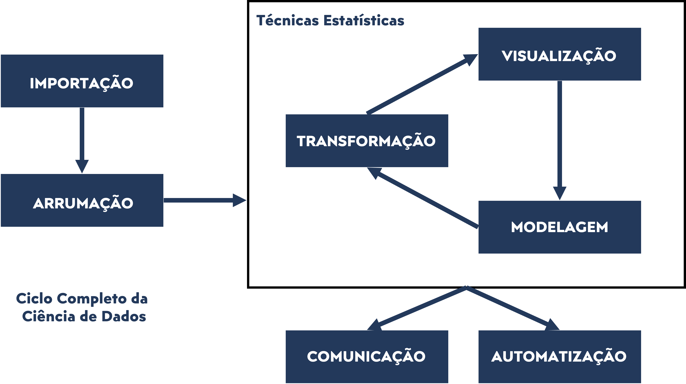
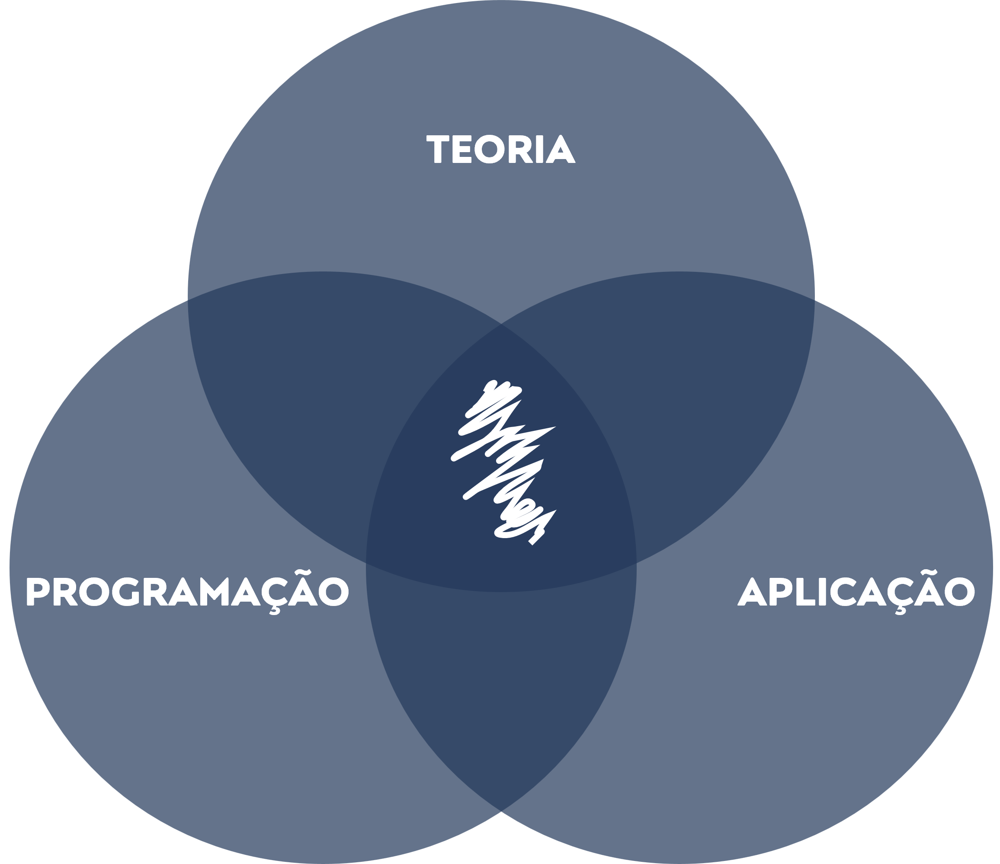

```{r ,echo=FALSE}

xaringanExtra::use_scribble()
xaringanExtra::use_search(show_icon = TRUE)
options(htmltools.dir.version = FALSE)
knitr::opts_chunk$set(
  fig.width = 9, 
  fig.height = 3.5, 
  fig.retina = 3,
  out.width = '100%',
  cache = TRUE,
  echo = FALSE,
  message = FALSE, 
  warning = FALSE,
  hiline = TRUE,
  fig.align = 'center'
)

```

class: inverse, center, middle

# COMEÇOU A DISCIPLINA DE CIÊNCIA DE DADOS PARA FINANÇAS PESSOAIS

```{r, echo = F, fig.align = 'center', out.width = '50%'}
knitr::include_graphics(
  'https://media.giphy.com/media/citBl9yPwnUOs/giphy.gif')
```


---
## APRESENTAÇÃO

- [**QUEM É O PROFESSOR?**](#sobre_professor)

--

- [**QUEM SÃO OS PARTICIPANTES?**](#sobre_participantes)

--

- [**QUAL A PROPOSTA DA DISCIPLINA?**](#ciencia_dados)

--

- [**QUAL O OBJETIVO DA DISCIPLINA?**](#objetivo_disciplina)

--

- [**COMO AS AULAS SERÃO ORGANIZADAS?**](#organizacao_aulas)

--

- [**COMO OS ATENDIMENTOS SERÃO ORGANIZADOS?**](#atendimentos)

--

- [**COMO SERÃO AS AVALIAÇÕES?**](#cronograma)


---
class: inverse, center, middle 
name: sobre_professor
# QUEM É O PROFESSOR?

```{r, out.width = '50%'}
knitr::include_graphics(
  'https://media.giphy.com/media/xT5LMVaLeMN0mGQM6c/giphy.gif')
```


---
<div style="text-align: justify">
## PRINCIPAIS INFORMAÇÕES
- **Nome:** *Victor Valerio*;

- **E-mail:** *victor.dmv@unifei.edu.br*;

- **Tel:** *+55 (35) 3629-1151*

- **Sala:** *B.3216 (1º Piso IEPG);*

- **Agenda:** https://profvictorunifei.shinyapps.io/agenda/


---
<div style="text-align: justify">
## FORMAÇÃO

- **GRADUAÇÃO**: Ciências Econômicas (UNESP);

- **MESTRADO**: Engenharia de Produção (UNIFEI)

- **DOUTORADO**: Engenharia de Produção (UNIFEI)


---
<div style="text-align: justify">
## ÁREAS DE ATUAÇÃO

- **DOCÊNCIA**: Economia (IEPG20), Engenharia Econômica (IEPG10), 
Macroeconomia (ADM03F), Análise 	de 	Investimento com Risco (ADM013), 
Metodologia Quantitativa em Administração (MPA033); **Ciência de Dados (ADM52F)**.

- **PESQUISA**: Modelos de Análise de Eficiência e Produtividade, Análise de 
Viabilidade Econômica, Energia 	Renovável, Ciência de Dados;

- **INSTITUCIONAL**: Representante do Estado de Minas Gerais na Ordem dos 
Economistas do Brasil (OEB); Coordenador do Núcleo de Excelência em Sistemas 
Fotovoltaicos (NE-SFV); Pesquisador Assistente no Centro de Hidrogênio Verde 
(CHV2); Coordenador de Graduação em Administração na UNIFEI; Coordenador da Rede
de Pesquisa (UNIFEI, UFLA, UFJF, UFMG).


---
class: center, middle 
## PAI DE PET

```{r, out.width = '30%'}

knitr::include_graphics('familia.jpeg')

```


---
class: center, middle
## MAIOR DO PAÍS

```{r, out.width = '40%'}

knitr::include_graphics(
  'https://media.giphy.com/media/ZeA9GkdqTLLm6I2Hab/giphy.gif')

```

---
class: center, middle
## CAMPEÃO SULMINEIRO DE SURF

```{r, out.width = '70%'}

knitr::include_graphics(
  'https://media.giphy.com/media/Y4tUCrgyyLEjcz4DPG/giphy.gif')

```


---
class: inverse, center, middle 
name: sobre_professor

# QUEM SÃO OS PARTICIPANTES?

```{r, echo = F, fig.align = 'center', out.width = '50%'}
knitr::include_graphics(
  'https://media.giphy.com/media/26gBjgcJMUqShHs4w/giphy.gif')
```


---
<div style="text-align: justify">
## PERGUNTAS A SEREM RESPONDIDAS

- Qual o seu nome?

- Qual o seu signo?

- Qual seu tema acadêmico de interesse?

- Qual seu hobby? (esporte, filmes/séries, dormir, dançar, fofocar...)

- Conte uma curiosidade sobre você.

---
class: inverse, center, middle
name: ciencia_dados

# QUAL A PROPOSTA DA DISCIPLINA?

```{r, echo = F, fig.align = 'center', out.width = '50%'}
knitr::include_graphics(
  'https://media.giphy.com/media/l2Jee9urV8szg0loY/giphy.gif')
```


---
<div style="text-align: justify">
## CIÊNCIA DE DADOS PARA FINANÇAS PESSOAIS

Basicamente, esta disciplina foi organizada para ser uma introdução à 
**Ciência de Dados** e, neste sentido, finanças pessoais se torna uma aplicação 
possível para a própria ciência de dados (esta foi a aplicação escolhida pois 
é uma disciplina aderente ao Projeto Pedagógico do curso de Administração).

Na prática, isto significa que vamos combinar conceitos de 
**estatística**, **programação** e **finanças** com a finalidade de gerar algum 
conhecimento a partir de um **conjunto de dados**. 

Contudo, a disciplina não está totalmente fechado à aplicações financeiras, pois
o campos de ciência de dados é vasto e pode se adequar aos interesses dos 
participantes.

---
<div style="text-align: justify">
## APLICAÇÃO MACROECONÔMICA

```{r }
library(magrittr, include.only = '%>%')


ibc_br_sa <- BETS::BETSget(24364, data.frame = T) %>% 
  
  dplyr::rename('Data' = date,
                
                'Valor' = value) %>% 

  ggplot2::ggplot() +

  ggplot2::geom_line(mapping = ggplot2::aes(x = Data, y = Valor),
                     
                     colour = '#23395b',
                     
                     size = .5) +

  ggplot2::geom_point(mapping = ggplot2::aes(x = Data, y = Valor),
                      
                      colour = '#23395b',
                      
                      size = .75) +

  ggplot2::labs(title = 'Índice de Atividade Econômica do Banco Central (IBC-Br)',
                
                x = 'Meses',
                
                y = 'Índice (2002 = 100 com ajuste sazonal)',
                
                caption = 'Dados: IBGE.') +
  
xaringanthemer::theme_xaringan(text_font_size = 15,
                               
                               title_font_size = 20)
  
  
ibc_br_sa <- plotly::ggplotly(ibc_br_sa)


widgetframe::frameWidget(ibc_br_sa, width = '100%', height = '100%')

```

---
<div style="text-align: justify">
## APLICAÇÃO DE MERCADO DE CAPITAIS

```{r}
library(quantmod)


ibov <- getSymbols(Symbols = '^BVSP',
                   src = 'yahoo', 
                   from = '2023-01-01', 
                   to = '2023-08-17',
                   env = NULL) 

chartSeries(ibov)
```


---
<div style="text-align: justify">
## CIÊNCIA DE DADOS

Em geral, os cientistas utilizam o chamado **método de pesquisa** para 
formular sua teorias. Sem maior rigor conceitual, podemos resumir o que é 
**método de pesquisa** a partir de uma sequência de 5 passos: 

- **Passo I**: Formulação de uma hipótese (questão ou um problema);

- **Passo II**: Coleta de informações relacionadas ao passo anterior. Essas 
informações podem ser obtidas a partir de experimentos ou de observações
de variáveis de interesse;


---
<div style="text-align: justify">
## CIÊNCIA DE DADOS

- **Passo III**: Aplicação de técnicas para formulação de alguma conclusão 
sobre a hipótese (questão ou um problema);

- **Passo IV**: Aplicação de teste da qualidade da conclusão obtida 
(confrontação com a realidade com a finalidade de falsear a conclusão);

- **Passo V**: Revisão de todos os passos anteriores. Condicionado ao 
resultado do passo anterior (apenas se a conclusão obtida não for válida).


---
<div style="text-align: justify">
## CIÊNCIA DE DADOS

Por sua vez, pode-se afirmar que a **estatística** é a parte da ciência 
voltada a **coletar**, **resumir**, **analisar** e **modelar** informações 
coletadas a respeito de determinado fenômeno (**dados**);

A partir da definição anterior, fica claro que a estatística é fundamental 
para o método de pesquisa, uma vez que, é a partir dela pode-se proceder os 
passos II, III e IV.


---
<div style="text-align: justify">
## CIÊNCIA DE DADOS

Ainda sobre o conceito de estatística, pode-se afirmar que a mesma pode ser
divida em duas grandes partes: 

- **Análise Exploratória de Dados**: Tem por objetivo realizar o resumo e 
interpretação inicial das informações coletadas (dados);

- **Inferência Estatística**: Totalmente dependente da primeira, tem por 
objetivo modelar as informações de modo a gerar alguma conclusão 
generalizável.


---
<div style="text-align: justify">
## CIÊNCIA DE DADOS

Em associação, o crescente **desenvolvimento computacional** acabou por 
impactar fortemente o cotidiano dos pesquisadores, visto que, acabou por 
**facilitar a implementação das mais diversas técnicas estatísticas** a 
partir da utilização de **softwares dedicados** (uso exclusivo de estatística, 
Minitab, SPSS, etc.), ou **não dedicados** (uso não exclusivo da estatística, 
Excel, Python, R, Julia, Etc.);

Em geral, os **softwares dedicados** são mais amigáveis por possuírem menus 
para execução das análises que se dão por meio de botões.


---
<div style="text-align: justify">
## CIÊNCIA DE DADOS

De outro lado, os softwares não dedicados requerem alguma familiaridade com 
**linguagem de programação**. Mas eles expandem os limites das aplicações, 
resolvendo **problemas anteriores** à estatística (**arrumação e 
transformação** dos dados)  e **problemas posteriores** aos resultados (**
automatização e comunicação**). 

Essas aplicações expandidas à estatística (mais uma vez, **arrumação, 
transformação, automatização e comunicação**) compõem o que é chamado de 
**Ciência de Dados**. Portanto, objetivo da nossa disciplina!


---
<div style="text-align: justify">
## CIÊNCIA DE DADOS

Representação do Ciclo da Ciência de Dados: 

```{r, echo = F, fig.align = 'center', out.width = '75%'}

```


---
class: inverse, center, middle
name: objetivo_disciplina

# QUAL O OBJETIVO DA DISCIPLINA?

```{r, echo = F, fig.align = 'center', out.width = '50%'}
knitr::include_graphics(
  'https://media.giphy.com/media/xT5LMsv6xxHIxliEOA/giphy.gif')
```


---
<div style="text-align: justify">
## OBJETIVO GERAL DA DISCIPLINA

Assim, pode-se afirmar que o **objetivo geral** da disciplina de 
**Ciência de Dados para finanças pessoais** consiste habilitar o estudante
a "**tirar conclusões consistentes**" a partir de um de um **conjunto de 
dados** relacionados a um determinado contexto (finanças). 
Tendo como plano de fundo para isso a **Ciência de Dados**.


---
<div style="text-align: justify">
## OBJETIVO GERAL DA DISCIPLINA

O grande desafio da disciplina é conciliar as diversas áreas de conhecimento.

--
```{r, echo = F, fig.align = 'center', out.width = '40%'}

```


---
class: inverse, center, middle
name: organizacao_aulas

# COMO AS AULAS SERÃO ORGANIZADAS?

```{r, echo = F, fig.align = 'center', out.width = '50%'}
knitr::include_graphics(
  'https://media.giphy.com/media/fBEDuhnVCiP16/giphy.gif')
```

---
<div style="text-align: justify">
## ORGANIZAÇÃO DAS AULAS

Em geral, nossas aulas serão:

- expositivas com foco nos conceitos e suas aplicações;

- Apresentações de problemas reais (inclusão do contexto de cada estudante, 
quando possível).

- Aulas práticas em laboratório com foco em conceitos da Ciências de Dados
(inclusão do contexto de cada estudante, quando possível).

---
class: inverse, center, middle
name: atendimentos

# COMO OS ATENDIMENTOS SERÃO ORGANIZADOS?

```{r, echo = F, fig.align = 'center', fig.alt= 'Gif da série the office para apresentar a organização dos atendimentos ', out.width = '50%'}
knitr::include_graphics(
  'https://media.giphy.com/media/vEJGsXtEE1Sc8/giphy-downsized-large.gif')
```

---
<div style="text-align: justify">
## ORGANIZAÇÃO DOS ATENDIMENTOS

Basicamente, teremos duas formas de atendimento para discutir dúvidas 
conceituais, aplicações específicas ao contexto de cada estudante ou mesmo 
dúvidas de programação.

- **REUNIÕES VIRTUAIS**

- **REUNIÕES PRESENCIAIS**

Em todas as formas você deverá agendar a reunião clicando  [**AQUI**](https://profvictorunifei.shinyapps.io/agenda/). Uma **dica** 
é dar preferência para as **reuniões virtuais** pois elas poderão ser 
gravadas e, assim, utilizadas para estudos futuros! 

---
<div style="text-align: justify">
## ORGANIZAÇÃO DOS ATENDIMENTOS

Em associação, foi criado um grupo de whatsapp para que possamos discutir temas 
relacionados à ciência de dados. Além disso, podemos utilizar o grupo para 
fortalecer a comunidade local de programação em R. 

A participação é opcional, mas recomendada na medida em que dinamiza a comunicação 
com o professor da disciplina e, obviamente, você também pode utilizar este grupo
para tirar dúvidas rápidas sobre a disciplina. 


Para ingressar no grupo basta clicar [**AQUI**](https://chat.whatsapp.com/FlU4FdWuwblHOhhLRdEUXC ).


---
class: inverse, center, middle
name: cronograma

# COMO SERÃO AS AVALIAÇÕES?

```{r, echo = F, fig.align = 'center', fig.alt= 'Gif da série the office para apresentar a organização dos atendimentos ', out.width = '50%'}
knitr::include_graphics(
  'https://media.giphy.com/media/l2JdZgzUpaNi2oxcQ/giphy.gif')
```

---
## COMPOSIÇÃO DAS NOTAS

- Equação Nota 1: $Nota_1  = 0,8. Trabalho_{parte 1} + 0,2.Questionários_{parte 1}$

- Equação Nota 2: $Nota_2  = 0,8 .Trabalho_{parte 2} + 0,2.Questionários_{parte 2}$

- Equação Nota Final: $Nota_{Final}  = (Nota_1 + Nota_2)/2$

---
class: inverse, center, middle

# MUITO OBRIGADO!

```{r, echo = F, fig.align = 'center', fig.alt= 'Gif para agradecer pela atenção e o tema é da série the office', out.width = '50%'}

knitr::include_graphics(
  'https://media.giphy.com/media/3orifgJJHKP0WZxmzC/giphy.gif')

```


